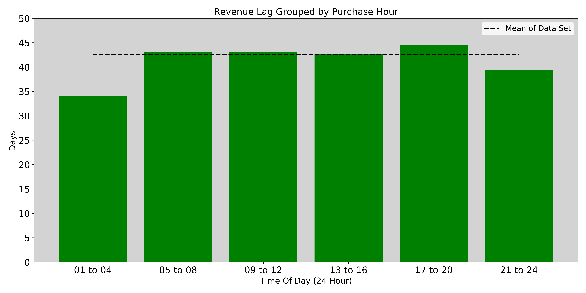
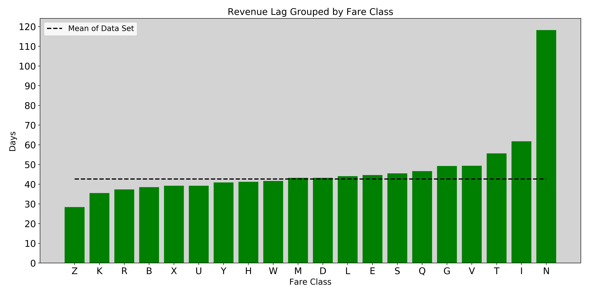
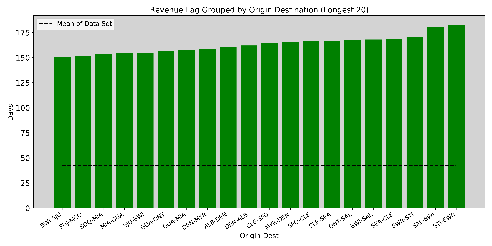
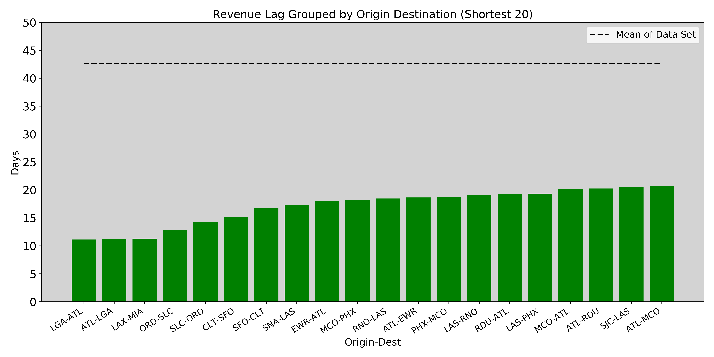
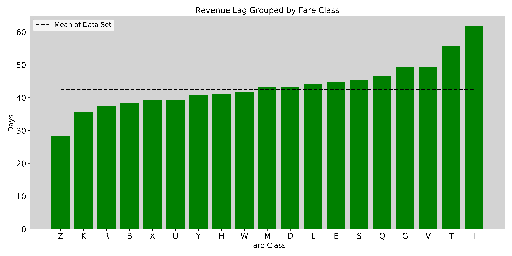

# Frontier Airlines Revenue

## Overview
For any business, revenue can not be classified as earned revenue until the service is provided. Most of the time for an airline this means flying a customer from point A to point B. Upon completion of the flight, the money paid for the flight is then considered earned regardless of how long ago the customer paid for the flight. This time in between revenue going from unearned to earned will be referred to as revenue lag. The longer the revenue lag the larger the revenue risk. Revenue risk is the idea that some potential event or condition negatively impacts earned revenue. 

## Motivation
Being a former employee of Frontier, I was curious to see if I could identify patterns between different attributes of ticket purchases and the revenue lag. I was hoping to find correlations that caused shorter revenue lags. The shorter revenue lag would mean a greater chance of taking the unearned revenue from booked flights and converting it into earned revenue from flown flights. 

## Data Set Information
The data I worked with came directly from Frontier Airlines' accounting systems and contained 1,760,407 rows. After being cleaned with I was left with 1,748,145 rows with booking dates ranging from October 14th, 2017 to January 31st, 2020. The initial data set had fifteen columns which were
- LedgerKey 
- FlightDate 
- GDSRecLoc
- BookingDate 
- LegOrigin 
- LegDest 
- SegmentOrigin 
- SegmentDest 
- FareClass 
- ModifiedAgent
- BookingAgent
- AirlineCode
- ScheduledDeparture
- FlightNumber
- HostAmount

Of these I decided to bring six which were flight date, booking date, segment origin, segment destination, fare class, and booking agent. All of these values came into my pandas data frame as a pandas data type object. I had to change the flight date and booking date into date-time objects. I used the booking date column to calculate the column Time of day which represents the hour in which the ticket was purchased. I also concatenated segment origin and segment destination into a new column then dropped the original columns to avoid any confusion. Finally, I had to calculate the revenue lag column by taking the flight date minus the booking date. Any columns that did not need to be changed I left as the pandas data type object. 

# EDA
## Revenue Lag based on Time Of Day
The first factor I thought could potentially lower revenue lag was the time of day the ticket was purchased. My belief behind this was that from the hours 9 AM to 4 PM would have the lowest revenue lag because it would be during this time when business customers would be purchasing tickets. Expanding this theory I expected that the hours between 5 PM and 8 PM would have the longest revenue lag because this would be when leisure travelers would be booking tickets for vacation. The plot below confirmed part of this theory with the longest revenue lag occurring from 5 PM to 8 PM. 
- Chi-sqaure: 2.095
- P-value: 0.836

## Revenue Lag based on Fare Class
The next possible factor that I thought might impact the revenue lag was the different fare classes. Fare buckets are assigned an alphabetical character as a way of classifying different characteristics of each ticket. The buckets are broken up by the size of the group, contract seats, or different price ranges. After my first initial plot, I noticed two fare classes with very short revenue lags. Both of these initial fare classes represented free tickets to employees or family as either a guaranteed seat or as standby ticket. Because of the lack of potential revenue associated with these tickets I decided to remove them from the entire data set. While I didn't have any concrete theories the plot clearly shows three fare classes that have some distance from the data set mean. Fare class N has the longest revenue lag and this fare class represents group sales of six or more tickets. The shortest revenue lags came from fare class Z and K which represents the two of the lower fare buckets Frontier offers. 
- Chi-sqaure: 157.268
- P-value: 8.605e-24

## Revenue Lag based on Origin and Destination
The final possible factor I thought could impact revenue lag is the different origin and destination combinations. Upon initial plotting, I found some origin-destination combinations that had perfectly even revenue lag means. Finding this highly suspicious I decided to remove combinations with less than 100 bookings. In total, I had a total of 715 unique destination and origin combinations. The twenty origin-destination combinations with the longest revenue lags can be seen in the first plot below and all combinations have revenue lags more than three times longer than the data set mean. The combinations with the shortest revenue lags also had a large spread between the data set mean and the means of each combination. The second plot highlights this fact with the largest mean being less than half that of the data set mean. 
- Chi-sqaure(entire grouping): 28916.020
- P-value(entire grouping): 0.0

# Final Analysis
For the final analysis, I did a chi-sqaure test for independence for all of the different graphs. First let's set our null hypothesis, alternative hypothesis, and significance level.
- Null Hypothesis: The mean of the entire data set and any variable used to group are independent.
- Alternate Hypothesis: The mean of the entire data set and any variable used to group not independent.
- alpha = .01

Looking at the first plot of revenue lag based on the time of day an individual booked the flight we observe a chi-square value of 2.095 which equates to a p-value of 0.836. This is above our significance level of .01 so we fail to reject the null hypothesis. This means that time of day a person books their flight does not have a significant effect on revenue lag. 

When comparing the different revenue lags for specific fare classes as in our second plot, the chi-square value came out as 157.268 with a p-value of 8.605e-24. With the p-value falling below our significance level we reject the null hypothesis in favor of the alternate stating that fare classes and revenue lag can not be seen as independent. Before accepting this though I went back and looked at the fare buckets. One of the biggest contributors to the large chi-square value was the fare class N, which symbolizes group sales of six or more people. Because there is nothing Frontier can do to increase the number of groups of six or more people traveling together, I recalculated the chi-square test without including N in the calculation. The chi-square and p-value were 23.077 and 0.187 respectively. This p-value indicates we fail to reject our null hypothesis when looking at fare classes that Frontier has control over. A graph highlighting this can be seen below. 

The final plots I made looked at the different origins and destinations and the revenue lag for the respective routes. For this, I received a chi-square value of 28916.020 and a p-value so small that python rounds it to zero. These kinds of results make sense when we look at the 20 largest revenue lags and the shortest 20 revenue lags. Both plots show the respective route revenue lag with a large spread compared to the data set mean. 

Ultimately if Frontier was in a position in which they wanted minimize revenue lag and revenue risk, while increasing the amount of revenue the went from unearned to earned they would want to consider routes that had the shortest revenue lag such as Laguardia to Atlanta or Los Angelas to Miami for as this is the only attribute that can be controlled by frontier that is not independent of the revenue lag. 

